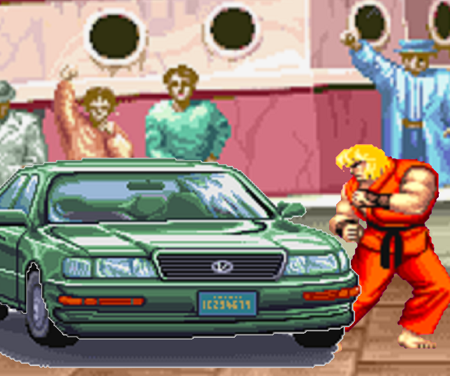

# SF2Bonus 🎮  

**SF2Bonus** is a game developed using [raylib](https://www.raylib.com), inspired by the iconic bonus stage from **Street Fighter II**.  

In this game, your objective is simple but challenging: **destroy the car** before the timer runs out! 💥  

---

## 🕹️ Gameplay  
Test your skills and reflexes as you smash your way through the car.  
- Beat the clock to achieve victory!  
- Relive the nostalgic vibe of classic arcade bonus stages.  

---

## 🎥 Preview  
Check out a video of the game in action: [Watch it here](https://youtu.be/7liXj2YrILM)  

---

## 📥 Download  
The latest version of **SF2Bonus** is available in the **[Releases](https://github.com/tortolavivo23/SF2Bonus/releases)** section. Download the game and start playing today!  

---

## 📸 Screenshots 

---

Feel free to share your feedback or report any issues in the repository.  
Enjoy the game! 🚗💥  

